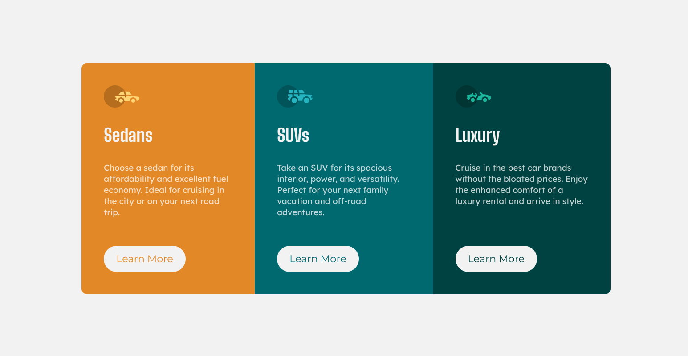
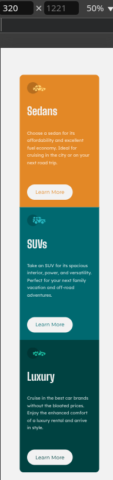

# Frontend Mentor - 3-column preview card component solution

This is a solution to the [3-column preview card component challenge on Frontend Mentor](https://www.frontendmentor.io/challenges/3column-preview-card-component-pH92eAR2-). Frontend Mentor challenges help you improve your coding skills by building realistic projects. 

## Table of contents

- [Overview](#overview)
  - [The challenge](#the-challenge)
  - [Screenshot](#screenshots)
  - [Links](#links)
- [My process](#my-process)
  - [Built with](#built-with)
  - [What I learned](#what-i-learned)
  - [Continued development](#continued-development)
  - [Useful resources](#useful-resources)
- [Author](#author)
- [Acknowledgments](#acknowledgments)

## Overview

### The challenge

Users should be able to:

- View the optimal layout depending on their device's screen size
- See hover states for interactive elements

### Screenshots




### Links

- Solution URL: [solution URL](https://github.com/Refat-web-dev/3-column-preview-card-component)
- Live Site URL: [live site URL](https://refat-web-dev.github.io/3-column-preview-card-component/)

## My process

### Built with

- Semantic HTML5 markup
- CSS custom properties
- Flexbox
- Responsive layout
- [Styled Components](https://fonts.google.com/) - For styles

### What I learned

Responsive layout - for example:
```css
@media (max-width:945px) {
    .title {
        font-size: 30px;
    }

    .text {
        font-size: 14px;
    }

    .card>button {
        font-size: 16px;
    }
}
```

### Continued development
I'm not sure if using min-height: 150px; for .text is the best solution here.
```css
.text {
    min-height: 150px;
}
```

### Useful resources

- [Youtube HTML](https://www.youtube.com/watch?v=W4MIiV4nZDY&t=268s&pp=ygUQaHRtbCDRgSDQvdGD0LvRjw%3D%3D) - This helped me to understand HTML.
- [Youtube CSS](https://youtu.be/WpridlBQmdk) - This helped me to understand CSS

## Author

- Telegram - [Refat Islyamov](https://t.me/Refat_web_dev)
- Frontend Mentor - [@refabatya](https://medium.com/@refabatya)
- Kinoarea - [Movie website](kinoarea-vite.netlify.app)
